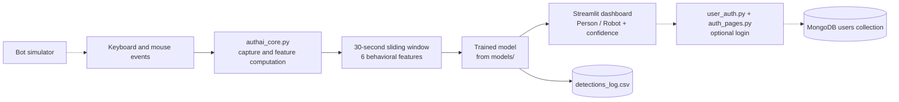

# AuthAI

**Real-time behavioral biometrics for bot detection: it watches how a user moves, types, and switches windows, and classifies the behavior as Person or Robot with a trained ML model.**


## Preview


---

## Overview

Passwords alone say nothing about *who* is behind the keyboard. AuthAI adds a behavioral layer: it captures mouse, keyboard, and window-switching activity in real time, turns it into a small set of features over a sliding window, and asks a trained model whether the behavior looks human or automated.

The project ships as a Streamlit dashboard with live charts, a built-in bot simulator for testing the detector, and an optional MongoDB-backed login/signup layer. Everything runs locally.

## Key Features

**Behavioral monitoring**
- Real-time capture of mouse movement, typing activity, tab/window switching, click frequency, and correction (backspace) rate
- Features computed over a 30-second sliding window; predictions refreshed every 2 seconds
- Live **Person / Robot** classification with a confidence score

**Machine learning**
- Loads trained models from `models/` and automatically selects the best-performing available model
- Supports Random Forest, XGBoost, Isolation Forest, and (when TensorFlow is installed) LSTM / Transformer / Autoencoder models
- Model benchmark results kept in `models/model_comparison_results.csv`

**Dashboard and testing**
- Streamlit dashboard with a prediction timeline and one time-series chart per behavioral feature
- Built-in **bot simulator** (15 seconds of rapid mouse movement, clicking, and typing) to see the detector flag automated behavior
- Every detection is appended to `detections_log.csv` for later analysis

**Authentication (optional, off by default)**
- User registration and login backed by MongoDB
- Passwords hashed with bcrypt; unique username and email constraints
- Session state and protected-route guards in Streamlit, profile view, and password change

## How It Works

1. **Capture**: monitors keyboard and mouse events while the app runs.
2. **Feature computation**: aggregates events over a 30-second sliding window.
3. **Prediction**: feeds the features to the selected trained model.
4. **Display**: updates the dashboard every 2 seconds and keeps a prediction history for trend analysis.
5. **Logging**: appends results to `detections_log.csv`.

### Features fed to the model

| Feature | Unit |
|---|---|
| Mouse speed | pixels / second |
| Typing speed | keys / minute |
| Tab switch rate | per minute |
| Mouse click rate | per minute |
| Keyboard error rate | % |
| Active window duration | seconds |

## Architecture



| Component | Responsibility |
|---|---|
| `authai_streamlit_app.py` | Streamlit GUI: sidebar controls, live metrics, charts |
| `authai_core.py` | Behavioral monitoring, feature computation, bot simulation |
| `models/` | Trained model files (`.joblib`, `.keras`) and comparison results |
| `user_auth.py`, `auth_pages.py` | Optional MongoDB authentication and login/signup pages |
| `setup_database.py` | Tests the MongoDB connection and creates demo users |

## Technology Stack

| Area | Technology |
|---|---|
| Language | Python 3.8+ |
| UI | Streamlit |
| Classical ML | scikit-learn (Random Forest, Isolation Forest), XGBoost, joblib |
| Deep learning | TensorFlow / Keras (LSTM, Transformer, Autoencoder) |
| Database (optional) | MongoDB |
| Password hashing (optional) | bcrypt |

## Engineering Highlights

- **Sliding-window feature engineering.** Raw input events become six normalized behavioral features over a 30-second window, refreshed every 2 seconds. This keeps predictions responsive without reacting to single events.
- **Pluggable model layer.** The app discovers whatever trained models are in `models/` and picks the best performer, so classical and neural models can be swapped without changing the UI code.
- **Built-in adversarial test harness.** The bot simulator generates automated-looking input so the full pipeline (capture, features, model, dashboard) can be verified end to end.
- **Local-only processing with an audit trail.** No behavioral data leaves the machine; each detection is logged to CSV.
- **Authentication as an opt-in module.** MongoDB, bcrypt hashing, unique constraints, and route guards are isolated in their own modules, so the monitor runs with no database at all.

## Project Structure

```text
Auth ai/
├── authai_streamlit_app.py    # Main Streamlit application
├── authai_core.py             # Behavioral monitoring, features, bot simulator
├── user_auth.py               # MongoDB user authentication (optional)
├── auth_pages.py              # Login / signup UI (optional)
├── setup_database.py          # MongoDB setup and demo users (optional)
├── requirements.txt           # Python dependencies
├── detections_log.csv         # Created automatically at runtime
└── models/
    ├── *.joblib               # scikit-learn / XGBoost models
    ├── *.keras                # Neural network models
    └── model_comparison_results.csv
```

## Getting Started

### Prerequisites

- Python 3.8+
- Trained model files in `models/` (for example `rf_model.joblib`, `xgb_model.joblib`, `iso_model.joblib`)
- Permission for the app to monitor keyboard and mouse events (on Windows you may need to run as administrator)
- MongoDB, only if you re-enable authentication

### Install and run

```bash
pip install -r requirements.txt
streamlit run authai_streamlit_app.py
```

Open `http://localhost:8501`, then:

1. Click **Initialize System** in the sidebar to load the model.
2. Click **Start Monitor** to begin tracking.
3. Use your computer normally and watch the live prediction, or click **Run Bot Simulator** to see automated behavior get flagged. Move the mouse to the top-left corner to abort the simulation early.

By default the app runs in **no-auth mode**: there is no login screen and the dashboard shows the user as "Guest".

### Optional: authentication with MongoDB

If you re-enable the login layer, start MongoDB and verify the connection and seed demo accounts:

```bash
python setup_database.py
```

Connection settings are constants at the top of `user_auth.py`:

```python
MONGODB_URI = "mongodb://localhost:27017/"
DATABASE_NAME = "authai_db"
COLLECTION_NAME = "users"
```

Stored user document:

```javascript
{
  "username": String (unique),
  "email": String (unique),
  "password_hash": String (bcrypt),
  "created_at": DateTime,
  "last_login": DateTime,
  "is_active": Boolean
}
```

## Security and Privacy

- Behavioral processing happens locally; no personal data is transmitted.
- Passwords are stored as bcrypt hashes with salt; usernames and emails are unique; minimum password length is 6 characters.
- Sessions live in Streamlit session state and are cleaned up on logout; authenticated pages are guarded.
- The demo accounts created by `setup_database.py` are for local testing only and should not be used outside a development setup.

## Troubleshooting

| Problem | Fix |
|---|---|
| Permission errors | Run as administrator (Windows) so input events can be monitored |
| Import errors | Reinstall with `pip install -r requirements.txt` |
| Model not found | Confirm trained models exist in `models/` |
| Neural models not loading | Check the TensorFlow installation |
| Slow performance | Reduce the detection interval or window size in the code |
| MongoDB connection fails | Check the service (`sudo systemctl start mongod` / `net start MongoDB`), `mongosh`, and port 27017 |

## Roadmap

**Implemented:** real-time monitoring, multi-model detection, live dashboard, bot simulator, CSV detection log, optional MongoDB login/signup with bcrypt.

**Potential improvements:**
- Password reset and email verification
- Role-based access control and multi-factor authentication
- Deeper behavioral analytics
- REST API endpoints
- Cloud deployment support
- Mobile integration

## UI Gallery

| Dashboard | Live monitoring | Detection view |
|---|---|---|
|  |  |  |

## Contributing

1. Fork the repository
2. Create a feature branch (`git checkout -b feature/your-feature`)
3. Commit your changes
4. Push the branch and open a Pull Request

## Author

Contact: [priyanshu345kumar@gmail.com](mailto:priyanshu345kumar@gmail.com)

## License

Released under the MIT License. See the `LICENSE` file for details.
